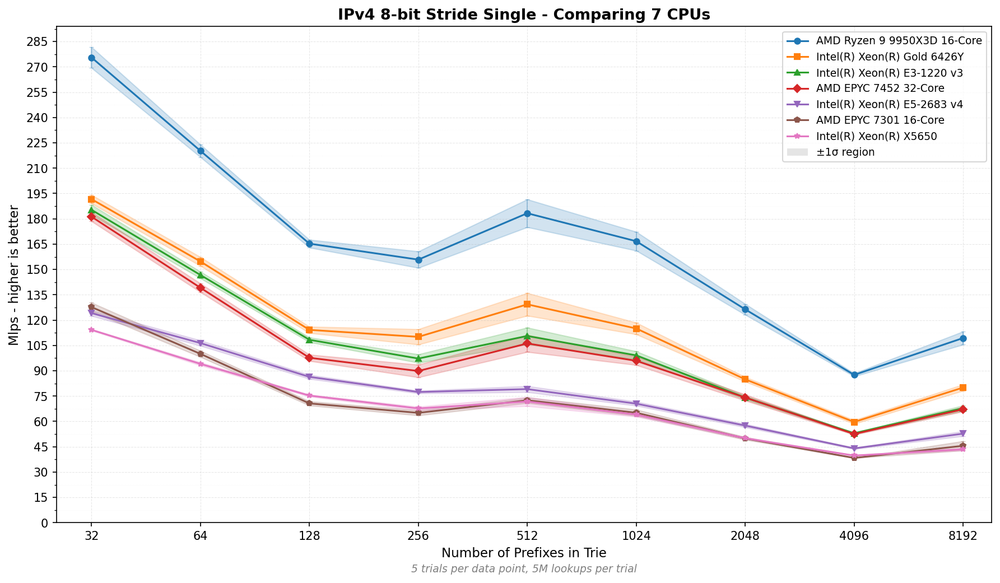
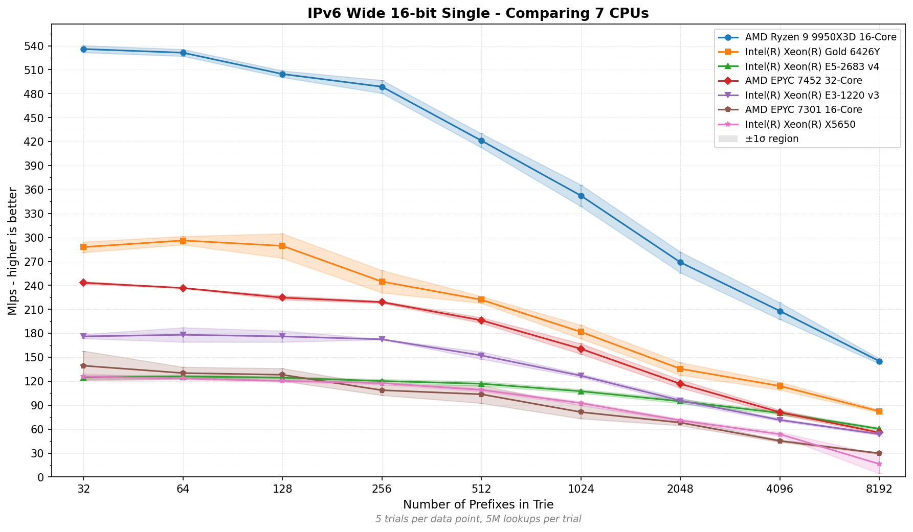
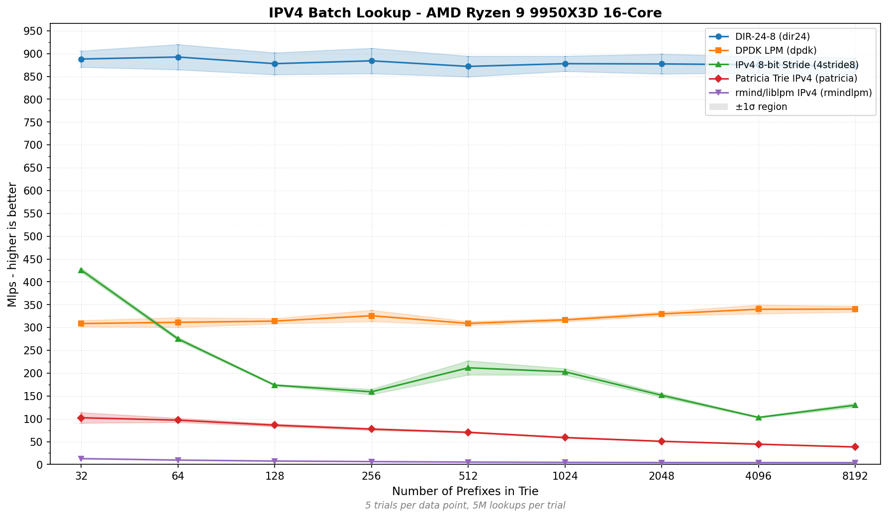
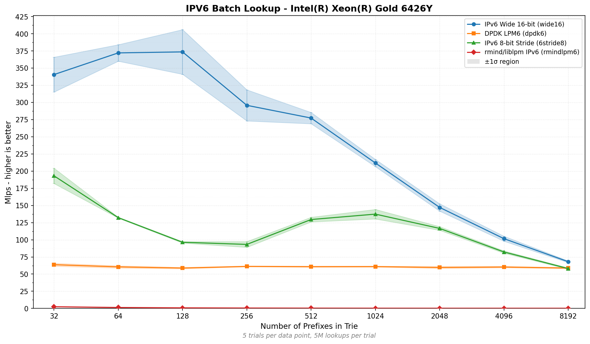
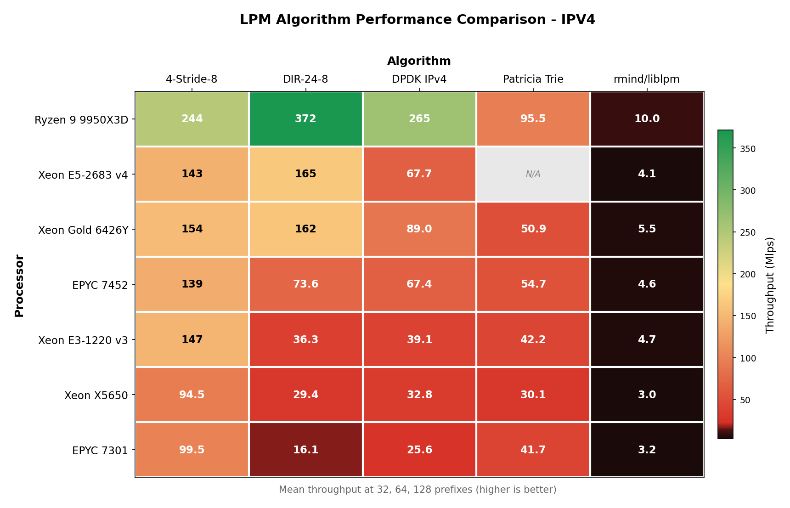
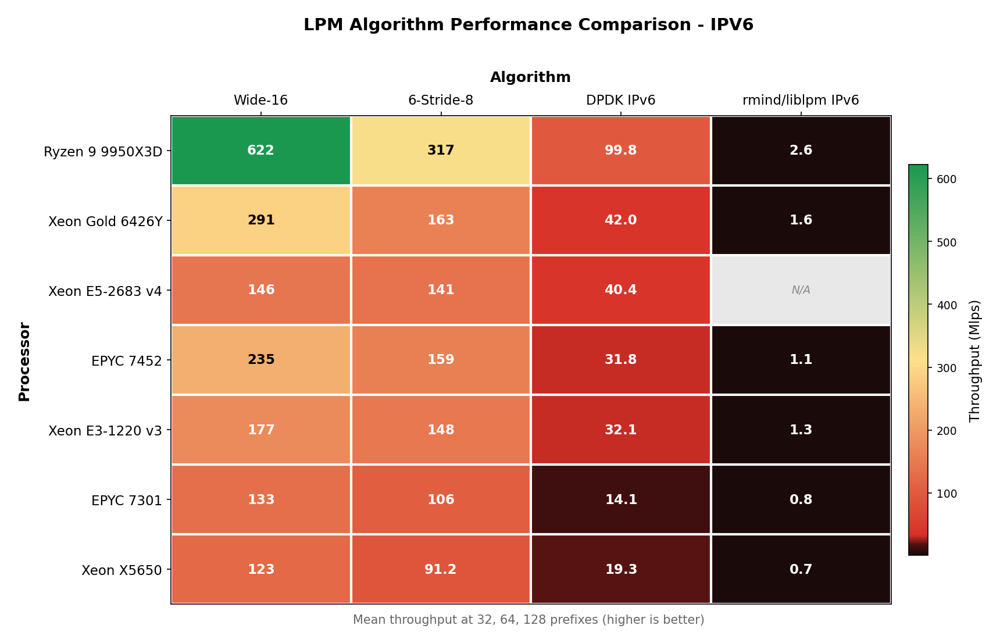

# High-Performance Longest Prefix Match Library

[](https://github.com/MuriloChianfa/liblpm/releases)
[](https://www.boost.org/LICENSE_1_0.txt)
[](https://github.com/MuriloChianfa/liblpm)
[](https://codecov.io/gh/MuriloChianfa/liblpm)
[](https://github.com/MuriloChianfa/liblpm/actions/workflows/ci.yml)
[](https://github.com/MuriloChianfa/liblpm/actions/workflows/codeql.yml)

A optimized C library for Longest Prefix Match (LPM) lookups supporting both IPv4 and IPv6 addresses. The library uses multi-bit trie with 8-bit stride for optimal performance and supports CPU vectorization.

## Features

- **High Performance**: Multi-bit trie with 8-bit stride reduces trie depth and improves cache.
- **Dual Stack Support**: Native support for both IPv4 (32-bit) and IPv6 (128-bit) addresses.
- **SIMD Optimizations**: Dynamic dispatching via [libdynemit](https://github.com/MuriloChianfa/libdynemit). (SSE2, SSE4.2, AVX, AVX2, AVX512F)
- **Batch Processing**: Vectorized batch lookup for processing multiple addresses simultaneously.
- **Branchless Design**: Optimized lookup paths with minimal branch mispredictions.
- **Cache-Friendly**: Aligned data structures and prefetching for optimal cache utilization.
- **C23 Standard**: Written in modern C with best practices.

## Performance

<p align="center">

<br>
<sub><i>IPv4 and IPv6 single lookup comparison among different CPU architectures</i></sub>
</p>

<p align="center">

<br>
<sub><i>Batch lookups leverage SIMD vectorization for even higher throughput</i></sub>
</p>

<p align="center">

<br>
<sub><i>Algorithm rankings showing mean throughput at small prefixes sets</i></sub>
</p>

For detailed benchmarks and methodology, see [docs/BENCHMARKS.md](docs/BENCHMARKS.md).<br>
Browse all benchmark charts in [docs/images/](docs/images/README.md).

## Building

### Requirements

<details open>
  <summary style="font-size: 16px;"><strong>Ubuntu/Debian</strong></summary>

  ```bash
  apt install build-essential cmake libc6-dev
  ```
</details>
<details>
  <summary style="font-size: 16px;"><strong>CentOS/RHEL/Rocky Linux</strong></summary>

  ```bash
  yum install gcc gcc-c++ make cmake3 glibc-devel
  ```
</details>
<details>
  <summary style="font-size: 16px;"><strong>Fedora</strong></summary>

  ```bash
  dnf install gcc gcc-c++ make cmake glibc-devel
  ```
</details>

### Build & Install
```bash
# Clone with submodules
git clone --recursive https://github.com/MuriloChianfa/liblpm.git
cd liblpm

# Or if already cloned, initialize submodules
git submodule update --init --recursive

# Build
mkdir build && cd build
cmake ..
make -j$(nproc)
sudo make install
```

## Usage

### Basic Example
```c
#include <lpm.h>
int main() {
    lpm_trie_t *trie = lpm_create(LPM_IPV4_MAX_DEPTH);
    
    // 192.168.0.0/16 -> next hop 100
    uint8_t prefix[] = {192, 168, 0, 0};
    lpm_add(trie, prefix, 16, 100);

    uint8_t addr[] = {192, 168, 1, 1};
    uint32_t next_hop = lpm_lookup(trie, addr);
    
    lpm_destroy(trie);
    return 0;
}
```

## API Reference

### Core Functions
- `lpm_create(max_depth)` - Create LPM trie (32 for IPv4, 128 for IPv6)
- `lpm_add(trie, prefix, prefix_len, next_hop)` - Add prefix to trie
- `lpm_delete(trie, prefix, prefix_len)` - Remove prefix from trie
- `lpm_destroy(trie)` - Free all resources

### Lookup Functions
- `lpm_lookup(trie, addr)` - Single address lookup
- `lpm_lookup_ipv4(trie, addr)` - IPv4-specific lookup
- `lpm_lookup_ipv6(trie, addr)` - IPv6-specific lookup
- `lpm_lookup_all(trie, addr)` - Lookup for multiple match

## Language Bindings

liblpm provides idiomatic bindings for multiple languages:

- **C** - Native library (see [include/lpm.h](include/lpm.h))
- **C++** - Modern C++17 wrapper with zero-cost abstraction (see [bindings/cpp/README.md](bindings/cpp/README.md))
- **Go** - Go binding with cgo (see [bindings/go/README.md](bindings/go/README.md))

**Note:** All bindings use network byte order (big-endian) for IP addresses, which is the internet standard. See [docs/BYTE_ORDER.md](docs/BYTE_ORDER.md) for details on data formats and integration.

## Tests and Fuzzing

The library includes some fuzzing tests to ensure robustness and catch edge cases. The fuzzing tests cover memory safety, API robustness, edge cases, and performance under stress.

```bash
cd build
ctest --verbose            # Run test suite
./benchmarks/bench_lookup  # Run benchmarks

./tests/fuzz_setup.sh      # Setup fuzzing environment
./build_afl.sh             # Build with AFL instrumentation
./run_fuzz.sh              # Run AFL fuzzing
```

For detailed information about the fuzzing tests, coverage areas,<br> and advanced fuzzing techniques, see [tests/FUZZING.md](tests/FUZZING.md).

## Containerized Development

<details>
  <summary style="font-size: 16px;"><strong>Docker Containers</strong></summary>

For a reproducible development environment with the latest toolchain (GCC 15.2, Clang 21.1, CMake 4.2), you can use Docker containers:

### Quick Start with Docker

```bash
# Build all containers
./scripts/docker-build.sh all

# Interactive development
docker run -it --rm -v "$PWD:/workspace" liblpm-dev

# Run tests
docker run --rm liblpm-test

# Run fuzzing
docker run --rm --cpus=4 liblpm-fuzz
```

### Available Containers

- **liblpm-dev**: Complete development environment
- **liblpm-test**: Automated testing with valgrind and cppcheck
- **liblpm-fuzz**: AFL++ fuzzing for security testing
- **liblpm-cpp**: C++ bindings development and testing
- **liblpm-go**: Go bindings development and testing
- **liblpm-benchmark**: DPDK rte_lpm performance comparison

For complete documentation, see [docs/DOCKER.md](docs/DOCKER.md).

</details>

## Verifying Binary Signatures

liblpm binaries are cryptographically signed with GPG for authenticity verification. To verify a downloaded binary:

### 1. Import the Public Key

Import the maintainer's public key directly from the keyserver using the key fingerprint:

```bash
gpg --keyserver keys.openpgp.org --recv-keys 3E1A1F401A1C47BC77D1705612D0D82387FC53B0
```

<details>
<summary><b>Alternative options</b></summary>

Using the shorter key ID:

```bash
gpg --keyserver keys.openpgp.org --recv-keys 12D0D82387FC53B0
```

**Alternative keyserver** (if `keys.openpgp.org` is unavailable):

```bash
gpg --keyserver hkp://keyserver.ubuntu.com --recv-keys 3E1A1F401A1C47BC77D1705612D0D82387FC53B0
```

</details>

You should see output confirming the key was imported:
```
gpg: key 12D0D82387FC53B0: public key "MuriloChianfa <murilo.chianfa@outlook.com>" imported
gpg: Total number processed: 1
gpg:               imported: 1
```

### 2. Verify the Signature

Assuming you have downloaded both the binary (`liblpm.so` or `liblpm.a`) and its signature file (`liblpm.so.asc` or `liblpm.a.asc`):

```bash
gpg --verify liblpm.so.asc liblpm.so
```

If the signature is valid, you should see:
```
gpg: Signature made [date and time]
gpg:                using EDDSA key 3E1A1F401A1C47BC77D1705612D0D82387FC53B0
gpg: Good signature from "MuriloChianfa <murilo.chianfa@outlook.com>"
```

If you see "BAD signature", **do not use** the binary - it may have been tampered with or corrupted.

## Documentation

Additional documentation:
- [Byte Order and Data Format](docs/BYTE_ORDER.md) - Endianness, IP address storage, and integration guide
- [C++ API Reference](bindings/cpp/README.md) - C++ wrapper documentation
- [Go API Reference](bindings/go/README.md) - Go bindings documentation

## Contributing

We welcome contributions from the community! Whether you're fixing bugs, adding features, improving documentation, or reporting issues, your help is appreciated.

- **[Contributing Guide](.github/CONTRIBUTING.md)** - How to contribute, coding standards, and development workflow
- **[Code of Conduct](.github/CODE_OF_CONDUCT.md)** - Community guidelines and expected behavior
- **[Issue Templates](.github/ISSUE_TEMPLATE/)** - Report bugs or request features
- **[Pull Request Templates](.github/PULL_REQUEST_TEMPLATE/)** - Submit changes with our PR templates

Before contributing, please read our [Contributing Guide](.github/CONTRIBUTING.md) and [Code of Conduct](.github/CODE_OF_CONDUCT.md).

## Security

If you discover any security vulnerabilities, please **DO NOT** open a public issue. Instead, refer to our [Security Policy](.github/SECURITY.md) for instructions on how to report security issues responsibly.

## License

This project is licensed under the Boost Software License 1.0 - see the [LICENSE](LICENSE) file for details.

## Citation

If you use liblpm in your research or project, please cite it using the information in [CITATION.cff](CITATION.cff).

## Credits

- [Murilo Chianfa](https://github.com/MuriloChianfa)
- [All Contributors](../../contributors)
